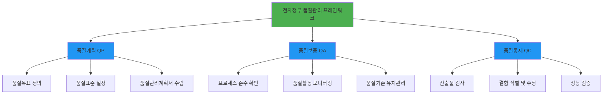
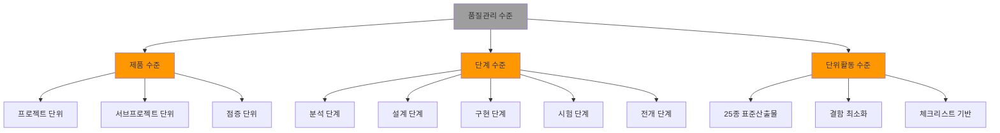
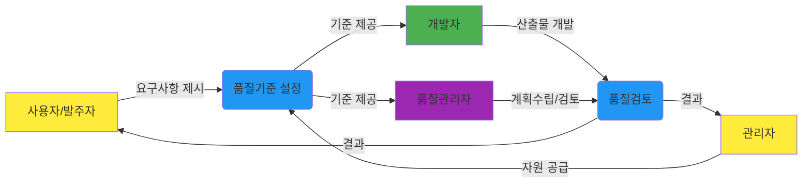
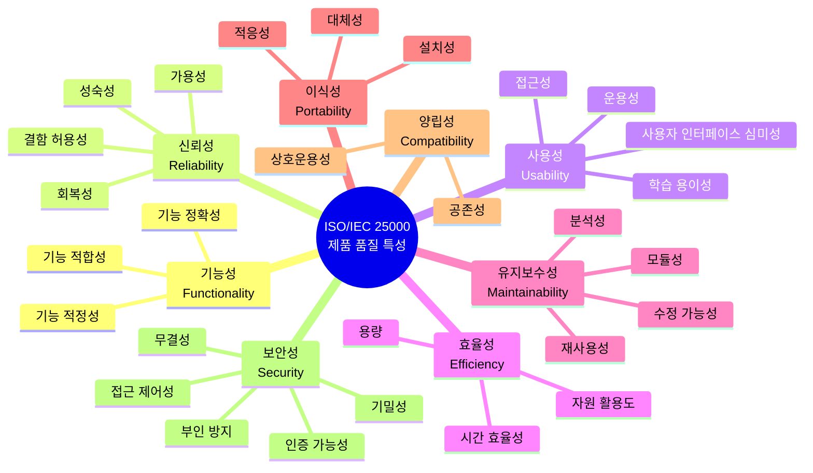
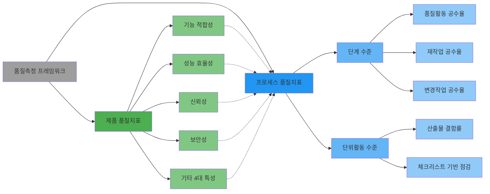
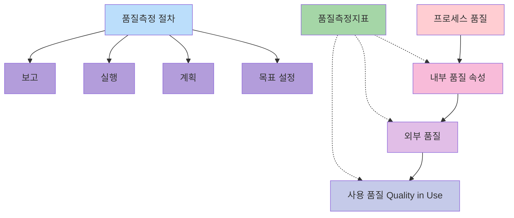

# 전자정부 품질관리 매뉴얼 - 감리 적용 가이드

## 개요

전자정부사업의 성공적인 수행을 위해 체계적인 품질관리 프레임워크와 구체적인 적용 지침을 제공합니다. 주요 내용은 품질계획(QP), 품질보증(QA), **품질통제(QC)**라는 세 가지 핵심 활동을 중심으로 구성되어 있으며, 이를 제품, 단계, 단위활동이라는 세 가지 수준에 맞춰 유연하게 적용하도록 안내합니다. 특히 발주자와 사업자 등 프로젝트 이해관계자별 역할을 명확히 정의하고, 사업의 규모나 개발 모형에 따른 최적의 품질관리 기준을 제시합니다. 또한 품질관리계획서와 결과보고서 등 필수적인 표준 산출물의 구성 요소와 검토 및 테스트 기법을 상세히 수록하고 있습니다. 결과적으로 이 자료는 정보시스템 구축 과정에서의 위험을 최소화하고 사용자 요구에 부합하는 고품질 서비스를 구현하는 것을 목적으로 합니다.

#### 전자정부 품질관리 프레임워크 개요

## 1. 품질관리 프레임워크의 목적

- **사업의 품질향상 및 성공 가능성 제고**: 품질관리 활동 강화를 통해 전자정부사업이 당초 목표한 품질을 달성하고 성공적으로 완료될 수 있도록 지원합니다.
- **이해관계자 업무 지원**: 개발사업자에게는 효과적인 품질 위험 대응을 위한 서식과 체크리스트를 제공하며, 발주기관에는 품질 기반의 발주 관리 역량을 지원합니다.
- **최적의 품질 수준 달성**: 제한된 시간과 자원을 고려하여 실패 비용을 줄이고 예방 및 평가 비용을 적절히 투입함으로써 최선의 품질 수준을 확보하는 데 그 목적이 있습니다.

## 2. 핵심 구성 요소

### ① 품질관리 3대 기본 활동 (QP-QA-QC)

프레임워크는 다음의 세 가지 활동이 반복·심화하는 구조를 가집니다.

- **품질계획 (QP, Quality Planning)**: 프로젝트 또는 상위 수준의 계획을 구체적인 프로세스와 산출물에 적용할 수 있도록 수립하는 단계입니다.
- **품질보증 (QA, Quality Assurance)**: 수립된 계획에 따라 프로세스와 산출물이 적절히 관리되어 품질 목표를 달성하도록 지원하는 활동입니다.
- **품질통제 (QC, Quality Control)**: 산출물의 결함을 제거하고 준거성과 성능을 확보하기 위해 검사 및 시험을 수행하는 단계입니다.

#### 품질관리 3대 활동 상호관계

### ② 3가지 품질관리 수준 (Levels)

사업의 규모와 특성에 따라 품질관리를 적용하는 깊이를 정의합니다.

- **제품 수준**: 프로젝트, 서브프로젝트, 점증 단위 등 최종 제품의 품질에 초점을 맞춥니다.
- **단계 수준**: 분석, 설계, 구현, 시험, 전개 등 개발 생명주기의 각 단계별 품질에 집중합니다.
- **단위활동 수준**: 단계를 구성하는 핵심 개발 산출물(총 25종) 단위로 결함을 최소화하는 활동입니다.

#### 품질관리 수준별 적용 구조

### ② 3가지 품질관리 수준 (Levels)

사업의 규모와 특성에 따라 품질관리를 적용하는 깊이를 정의합니다.

- **제품 수준**: 프로젝트, 서브프로젝트, 점증 단위 등 최종 제품의 품질에 초점을 맞춥니다.
- **단계 수준**: 분석, 설계, 구현, 시험, 전개 등 개발 생명주기의 각 단계별 품질에 집중합니다.
- **단위활동 수준**: 단계를 구성하는 핵심 개발 산출물(총 25종) 단위로 결함을 최소화하는 활동입니다.

### ③ 프로젝트 수행 4자 간의 역할과 책임

효과적인 품질관리를 위해 이해관계자 간의 협업 체계를 정의합니다.

- **사용자(발주자)**: 품질 관련 요구사항 및 기대수준을 제시하고 최종 산출물을 검수 및 인수합니다.
- **관리자**: 품질 기준을 제시하고 활동에 필요한 자원(시간, 인력 등)을 공급합니다.
- **개발자**: 표준을 준수하여 산출물을 작성하고 시스템을 개발하며, 발견된 결함을 시정합니다.
- **품질관리자**: 품질관리계획(QP)을 수립하고, 독립적인 관점에서 품질 검토 및 보고를 수행합니다.

#### 이해관계자 간 협업 체계

### ④ 품질측정 및 도구

- **품질측정지표**: ISO/IEC 25000(SQuaRE) 표준을 기반으로 제품 품질과 개발 프로세스 품질을 측정하기 위한 지표를 활용합니다.
- **품질관리 산출물**: 품질관리계획서, 품질관리활동내역, 품질관리결과보고서 등이 핵심 산출물로 구성됩니다.
- **도구와 기법**: 비실행 기반의 검토회(Walk-through) 및 검사(Inspection), 실행 기반의 테스트 기법 등을 포함합니다

## 3. 품질관리 3대 핵심 활동 상세 설명

### 3.1 품질계획 (QP, Quality Planning)

- **정의**: 프로젝트의 목표나 상위 수준의 품질 지침을 실제 수행할 프로세스와 산출물에 적용할 수 있도록 구체화하는 단계입니다.
- **주요 활동**: 품질목표 정의, 품질표준 및 지표 설정, 품질관리계획서 수립, 점검을 위한 체크리스트 준비 등이 포함됩니다.
- **산출물**: 가장 핵심적인 산출물은 품질관리계획서입니다.

### 3.2 품질보증 (QA, Quality Assurance)

- **정의**: 수립된 품질계획이 실제 프로세스와 산출물에 잘 적용되어 품질목표를 달성해 나가도록 지원하는 예방 중심의 활동입니다.
- **주요 활동**: 개발 표준 및 체크리스트 준수 여부 교육, 프로세스 수행 모니터링, 품질 활동에 대한 피드백 및 인증 활동을 수행합니다.
- **특징**: 개발자가 품질 마인드를 가지고 표준을 준수하며 개발할 수 있도록 독려하고 지원하는 데 주안점을 둡니다.

### 3.3 품질통제 (QC, Quality Control)

- **정의**: 개발된 프로세스와 산출물의 결함을 식별하여 제거하고, 요구사항에 대한 준거성과 성능을 확보하는 검사 중심의 활동입니다.
- **주요 활동**: 비실행 기반의 **검토회(Walk-through)**나 검사(Inspection), 실행 기반의 각종 **테스트(단위, 통합, 시스템 테스트)**를 통해 결함을 발견하고 시정조치를 요구합니다.
- **산출물**: 품질평가 보고서, 결함 및 시정조치 보고서, 품질지표 분석 보고서 등이 작성됩니다.

이러한 3대 활동은 단순히 품질관리자만의 업무가 아니라 사용자, 관리자, 개발자, 품질관리자라는 프로젝트 수행 4자 간의 명확한 역할 분담과 협업을 통해 이루어집니다. 소규모 사업에서는 단계 수준에서, 대규모 사업에서는 단위활동 수준까지 세분화하여 이 활동들을 적용함으로써 최적의 품질 수준을 달성하는 것을 목적으로 합니다.

## 4. 수준별 품질관리 적용 기준 및 산출물

### 4.1 제품 수준의 품질관리 (Product Level)

제품 수준은 프로젝트의 전체적인 제품 품질에 초점을 맞추며, 사업 수행 방식(폭포수 또는 점증 모형)에 관계없이 적용됩니다.

**적용 기준:**
- **프로젝트 단위**: 전체 시스템을 하나의 제품으로 보고 제안/계약부터 종료/전환까지 전 과정을 관리합니다.
- **서브프로젝트 단위**: 전체 시스템을 구성하는 부분 시스템(컴포넌트)별로 품질관리가 필요할 때 적용하며, 프로젝트 수준의 계획을 해당 서브프로젝트 차원에서 구체화하여 이행합니다.
- **점증 단위**: 시스템을 여러 개의 점증(Increment)으로 나누어 개발할 때 적용하며, 각 점증 단위의 수만큼 품질관리 활동이 반복됩니다.

**주요 산출물:**
- **품질관리계획서**: 착수 단계에서 수립하며 고객의 승인이 필수적입니다.
- **품질관리활동내역**: 실행 단계에서 작성하는 주기적(주간/월간) 보고서입니다.
- **품질관리결과보고서**: 종료 단계에서 품질 목표 달성 정도를 종합하여 제출하며 고객의 확인이 필요합니다.

### 4.2 단계 수준의 품질관리 (Phase Level)

폭포수 모형의 개발 생명주기(분석-설계-구현-시험-전개)에 따라 각 단계별 품질 활동과 산출물 품질에 집중하는 방식입니다.

**적용 기준:** 우리나라 정보화 사업에서 가장 일반적으로 적용되는 수준입니다. 전 단계의 산출물이 후 단계의 입력물이 되는 구조이므로, 단계별 산출물에 대해 엄격한 품질 기준을 적용하여 결함 전이를 방지하는 것이 핵심입니다.

**주요 산출물:**
- **단계별 품질관리계획서, 활동내역서, 결과보고서**: 각 단계(분석, 설계, 구현, 시험, 전개)가 시작될 때 계획을 보완하고, 종료 시 결과를 보고합니다.
- **단계별 품질측정지표**: 품질활동, 재작업, 변경작업에 투입된 공수율 등을 측정하여 관리합니다.

### 4.3 단위활동 수준의 품질관리 (Activity Level)

단계를 구성하는 구체적인 개발 활동(Activity) 수준에서 산출물의 결함을 최소화하는 데 초점을 맞춘 가장 세밀한 관리 방식입니다.

**적용 기준:** "CBD SW개발 표준산출물 관리가이드"에서 제시하는 총 25종의 핵심 개발 산출물을 대상으로 합니다. 각 산출물을 작성하는 단위활동마다 품질계획(QP)-품질보증(QA)-품질통제(QC)를 반복 수행하여 결함을 식별하고 수정합니다.

**주요 산출물:**
- **25종의 핵심 산출물**: 분석(사용자 요구사항 정의서 등 3종), 설계(클래스 설계서, 아키텍처 설계서 등 12종), 구현(프로그램 코드 등 3종), 시험(통합/시스템 시험 결과서 2종), 전개(사용자/운영자 지침서 등 5종) 등이 포함됩니다.
- **단위활동 수준 품질측정지표**: 체크리스트를 기반으로 각 산출물별 결함률 등을 측정합니다.
- **표준산출물 체크리스트**: 각 산출물의 적절성을 점검하기 위한 상세 항목들로 구성됩니다.

이러한 수준별 품질관리 활동은 사업의 규모(금액, 인력, 기간 등)에 따라 선택적으로 적용되며, 소규모 사업의 경우 서브시스템이나 단계 수준을, 대규모 사업의 경우 보다 세분화된 단위활동 수준을 고려할 수 있습니다.

## 5. ISO/IEC 25000을 활용한 제품 품질 특성

전자정부사업 품질관리 매뉴얼은 ISO/IEC 25000(SQuaRE) 국제 표준 모델을 기반으로 사용자 관점에서 시스템 품질을 평가하기 위한 8가지 제품 품질 특성을 정의하고 있습니다,.

#### ISO/IEC 25000 제품 품질 특성 모델

### 5.1 제품 품질의 8가지 특성

1. **기능성 (Functional Suitability)**: 사용자의 요구사항이 시스템에 얼마나 적절히 반영되었는지를 나타내며, 완전성, 정확성, 적정성을 포함합니다,.
2. **신뢰성 (Reliability)**: 시스템이 일정 기간 특정 조건에서 명시된 수준의 성능을 유지할 수 있는 정도로, 성숙성, 가용성, 결함허용성, 회복성이 해당됩니다,.
3. **사용성 (Usability)**: 사용자가 시스템을 사용하는 데 있어 이해하고 학습하며 운영하기 쉬운 정도를 의미합니다. 적합인식성, 학습용이성, 운용성, 사용자 인터페이스 심미성, 접근성을 포함합니다,.
4. **효율성 (Performance Efficiency)**: 시스템이 사용하는 자원의 양과 반응 시간 등을 평가하며, 시간효율성, 자원활용도, 용량으로 구성됩니다,.
5. **유지보수성 (Maintainability)**: 시스템이 수정이나 환경 변화에 대응하여 개선되기 쉬운 정도로, 모듈성, 재사용성, 분석성, 수정가능성을 평가합니다,.
6. **이식성 (Portability)**: 한 환경에서 다른 환경으로 시스템을 옮기기 쉬운 정도를 나타내며, 적응성, 설치성, 대체성이 포함됩니다,.
7. **양립성 (Compatibility)**: 다른 시스템이나 구성 요소와 정보를 교환하거나 동일한 환경에서 공존할 수 있는 능력으로, 공존성 및 상호운용성을 포함합니다,.
8. **보안성 (Security)**: 정보와 데이터를 보호하고 인가된 사용자에게만 접근을 허용하는 정도로, 기밀성, 무결성, 부인방지, 접근제어성, 인증가능성 등을 측정합니다,.

이러한 8가지 특성은 제품 수준의 품질 목표를 정의하고 구체적인 품질측정지표를 도출하는 기준이 됩니다,. 개발 사업자는 착수 및 계획 단계에서 이러한 모델을 활용하여 제품 품질 목표를 정의하고 품질관리계획서에 반영해야 합니다.

## 5.1 품질기준의 정의와 체계

전자정부사업 품질관리 매뉴얼에서 정의하는 품질기준은 사용자의 요구사항에 부합하는 정보시스템을 구축하기 위한 목표이자 준거 틀입니다,.

매뉴얼은 품질기준과 관련하여 다음과 같은 구체적인 체계와 내용을 제시하고 있습니다.

### 5.1.1 품질의 기본 정의와 목표

- **사용자 요구 충족**: 정보화 사업의 성공 4요소(비용, 일정, 품질, 범위) 중 품질은 사용자의 요구를 충족시켜야 할 궁극적인 목표로 정의됩니다.
- **요구사항 부합**: 품질관리 프레임워크는 프로젝트의 품질목표인 요구사항 부합을 달성하기 위한 활동 체계입니다.

### 5.1.2 ISO/IEC 25000 기반 제품 품질 특성

제품 수준의 품질기준을 정의하기 위해 국제 표준인 ISO/IEC 25000(SQuaRE) 모델을 활용하며, 8가지 주요 특성을 기준으로 삼습니다,.

- **기능 적합성**: 요구사항 반영률, 정확성 등.
- **신뢰성**: 성숙성, 가용성, 결함 허용성, 회복성.
- **사용성**: 학습 용이성, 인터페이스 심미성, 접근성 등.
- **성능 효율성**: 응답시간, 자원 활용도, 용량.
- **유지보수성**: 모듈성, 재사용성, 수정 가능성.
- **보안성**: 기밀성, 무결성, 접근 제어성 등.
- **양립성 및 이식성**: 상호운용성, 설치성 등.

### 5.1.3 단계 및 단위활동별 품질기준

- **단계별 엄격한 기준 적용**: 전 단계의 산출물이 후 단계의 입력물이 되므로, 결함 전이를 방지하기 위해 각 단계별 산출물에 매우 엄격한 품질기준을 적용해야 합니다,.
- **프로세스 품질 목표**: 단계 수준에서는 결함률과 품질비용(투입 공수) 등을 품질 목표와 기준으로 정의합니다.
- **단위활동 산출물 표준**: "CBD SW개발 표준산출물 관리가이드"에 따른 25종의 표준 산출물을 대상으로 결함을 최소화하기 위한 체크리스트를 품질 점검의 기준으로 활용합니다,.

### 5.1.4 이해관계자별 역할

- **관리자(발주자)**: 사용자 요구에 부합하는 품질기준을 제시하고, 제약사항을 결정합니다,.
- **개발자**: 제시된 품질표준 및 품질기준에 입각하여 산출물을 개발하고 시스템을 구축합니다.
- **품질관리자**: 품질목표 및 산출물 작성 표준을 정의하고, 품질관리계획(QP)을 수립하여 기준 준수 여부를 검토합니다,.

### 5.1.5 품질측정지표 (Quality Measures)

품질기준의 달성 여부를 객관적으로 확인하기 위해 구체적인 지표를 설정합니다.

- **제품 지표**: 기능 요구사항 반영률, 평균 응답시간, CPU 사용률, 데이터 암호화 정확성 등,.
- **프로세스 지표**: 품질활동 투입 공수율, 재작업 투입 공수율, 변경작업 투입 공수율 등.

사업자는 이러한 기준들을 바탕으로 품질관리계획서를 작성하여 착수 단계에서 발주자의 승인을 얻어야 하며, 실행 단계에서는 이 기준에 따라 품질보증(QA) 및 품질통제(QC) 활동을 수행해야 합니다,.

## 5.2 품질측정 프레임워크

전자정부사업 품질관리 매뉴얼은 품질측정 프레임워크를 통해 품질지표를 크게 제품 품질측정지표와 개발프로세스 품질측정지표의 두 가지 분야로 구분하여 정의하고 있습니다.

### 5.2.1 제품 분야 품질지표 (Product Quality Measures)

전자정부사업 품질관리 매뉴얼에서 정의하는 제품분야 품질지표는 사용자 관점에서 정보시스템의 품질 특성을 객관적으로 평가하기 위한 기준입니다. 이 지표들은 국제 표준인 ISO/IEC 25000(SQuaRE) 모델을 기반으로 하며, 총 8가지 품질 특성과 그에 따른 세부 지표들로 구성됩니다,.

제품분야 품질지표의 주요 항목과 구체적인 예시는 다음과 같습니다.

#### 1. 8대 제품 품질 특성 및 주요 지표

- **기능 적합성 (Functional Suitability)**: 사용자의 요구사항이 시스템에 얼마나 반영되었는지를 측정합니다.
    - **기능 요구사항 반영률**: 요구사항 중 시스템에 실제 반영된 비율,.
    - **기능 요구사항 정확성**: 요구된 기능이 시스템에 올바르게 구현되었는지 여부.

- **성능 효율성 (Performance Efficiency)**: 시스템의 반응 속도와 자원 활용도를 측정합니다.
    - **응답시간**: 사용자가 클릭한 후 결과가 표출될 때까지의 시간.
    - **CPU/메모리 사용률**: 작업을 수행하는 데 사용된 자원의 양.

- **신뢰성 (Reliability)**: 시스템이 장애 없이 운영되거나 고장을 회복하는 능력을 측정합니다.
    - **평균무고장시간(MTBF)**: 다음 고장 발생까지의 평균 연속 가동 시간.
    - **평균회복시간**: 시스템 고장을 복구하는 데 소요되는 평균 시간.
    - **결함 허용성**: 결함 발생 시 명시된 수준의 성능을 유지하는 정도.

- **사용성 (Usability)**: 사용자가 시스템을 얼마나 쉽게 이해하고 사용할 수 있는지를 측정합니다.
    - **학습 용이성**: 매뉴얼이나 산출물을 통해 사용법을 이해하기 쉬운 정도.
    - **메시지 명료성**: 시스템 메시지가 이해하기 쉬운지 측정.

- **보안성 (Security)**: 정보 보호 및 접근 제어 능력을 측정합니다.
    - **데이터 암호화**: 정의된 데이터의 암·복호화가 정확히 구현되었는지 측정.
    - **접근 감사성**: 사용자 접근과 관련된 감사 추적의 완전성 측정.

- **기타 특성**:
    - **양립성**: 타 시스템과의 데이터 교환성 및 무결성.
    - **유지보수성**: 문제를 해결하기 위해 소프트웨어를 쉽게 수정할 수 있는 수정 복잡도.
    - **이식성**: 새로운 환경과의 사용자 지원기능 일관성.

#### 2. 품질지표의 관리 및 적용 방법

- **정의 및 계획**: 착수 및 계획 단계에서 프로젝트의 특성에 맞는 품질지표 프로파일을 정의하고 품질관리계획서에 명시해야 합니다,.
- **측정 절차**: 제품 품질지표는 프로젝트 단위, 서브프로젝트 단위, 점증적 개발 단위에서 측정되며, 내부 및 외부 품질 속성이 최종적인 **사용 품질(Quality in Use)**에 영향을 미친다는 라이프사이클을 따릅니다.
- **지표 정의서 활용**: 각 지표는 측정 데이터, 계산식(예: 반영률 = (반영 건수 / 전체 요구사항 수) * 100), 측정 도구, 측정 주기(설계, 시험, 종료 등) 및 담당자가 구체적으로 정의되어야 합니다.
- **결과 보고**: 측정된 결과는 품질관리활동내역서에 기록되고, 최종적으로 품질관리결과보고서를 통해 목표 달성 여부가 고객에게 확인됩니다,.

제품 품질지표는 단순히 결함을 찾는 지표가 아니라, 실패 비용을 줄이고 사용자의 품질 요구사항을 충족시키기 위한 핵심적인 관리 도구로 활용됩니다,.

### 5.2.2 프로세스 분야 품질지표 (Process Quality Measures)

개발프로세스 품질지표는 개발 공정의 각 단계별 품질관리 활동이 얼마나 효과적으로 수행되고 있는지를 측정하는 데 주안점을 둡니다. 이는 다시 단계 수준과 단위활동 수준으로 나뉩니다.

#### 1. 프로세스 분야 품질지표의 분류

전자정부사업 품질관리 매뉴얼에 따르면 개발프로세스 품질측정지표는 크게 두 가지 수준으로 나뉩니다:

- **단계 수준**: 품질활동, 재작업, 변경작업에 투입된 **공수(Man-hour)**를 측정하는 데 중점을 둡니다.
- **단위활동 수준**: 개발의 최하위 단위인 표준 산출물별 결함률을 산정하는 데 중점을 둡니다.

#### 2. 단계 수준 품질지표 (Phase Level)

- **측정 대상**: 분석, 설계, 구현, 시험, 전개 등 개발 생명주기의 각 단계.
- **주요 지표**: 품질활동에 투입된 **공수(Man-hour)**를 중심으로 관리합니다.
    - **품질활동 투입 공수율**: 전체 공수 대비 품질관리 활동에 투입된 비율.
    - **재작업 투입 공수율**: 결함 수정 등 재작업에 투입된 공수 비율.
    - **변경작업 투입 공수율**: 요구사항 변경 등으로 인한 추가 작업 공수 비율.
- **관리 방법**: '품질결함 및 시정조치 관리대장'에 기록된 데이터를 기반으로 산정합니다.

#### 3. 단위활동 수준 품질지표 (Activity Level)

- **측정 대상**: 단계를 구성하는 최하위 단위활동인 표준 산출물(총 25종).
- **주요 지표**: 산출물별 결함률.
    - 체크리스트를 기반으로 산출물의 누락, 부정확, 불완전 요구사항을 식별하여 측정합니다.
- **관리 방법**: 표준산출물 체크리스트를 통한 점검 활동으로 지표를 도출합니다.

#### 4. 구체적인 결함률 지표 예시

전자정부사업 품질관리 매뉴얼에 따르면, 다음과 같은 구체적인 결함률 지표들이 단위활동 수준의 프로세스 품질지표에 포함됩니다:

- **사용자 인터페이스 결함률**: 설계 단계의 표준 산출물인 **'사용자 인터페이스 설계서'**에 대한 결함 검토를 통해 산출됩니다.
- **시스템 인터페이스 결함률**: 설계 단계의 표준 산출물인 '시스템 인터페이스 설계서'(또는 인터페이스 설계서)의 결함 점검 지표입니다.
- **데이터베이스 설계 결함률**: 설계 단계의 핵심 산출물인 '데이터베이스 설계서' 또는 '엔티티 관계 모형 기술서' 등의 결함률을 의미합니다.
- **통합시험 결함률**: 시험 단계에서 작성되는 '통합시험 결과서' 또는 **'통합시험 시나리오'**를 기반으로 식별된 결함 수치를 측정하는 지표입니다.

매뉴얼은 프로세스 품질 목표를 결함률과 품질비용 등으로 정의하고 있으며, 특히 각 산출물에 대한 누락, 부정확, 불완전 요구사항을 식별하여 **'산출물별 결함률'**을 산정하는 것을 단위활동 수준의 프로세스 품질지표로 명시하고 있습니다.

따라서 사용자/시스템 인터페이스, 데이터베이스 설계, 통합시험과 관련된 결함률 지표들은 모두 단위활동 수준의 개발프로세스 품질측정지표에 해당합니다.

요약하자면, 제품 지표는 완성된 시스템이 ISO 표준의 품질 특성을 얼마나 만족하는지 측정하며, 프로세스 지표는 개발 과정에서 투입된 **품질 비용(공수)**과 산출물의 결함률을 관리하여 실패 비용을 줄이는 데 목적이 있습니다.

#### 제품 품질지표와 프로세스 품질지표 관계도

### 5.2.3 품질측정의 핵심 체계와 주요 지표

품질측정의 핵심 체계와 주요 지표는 다음과 같습니다.

- **품질 라이프사이클**: 품질측정은 프로세스 품질이 내부 품질 속성에 영향을 미치고, 이것이 외부 품질을 거쳐 최종적인 **사용 품질(Quality in Use)**에 영향을 미친다는 의존 관계를 기반으로 합니다.
- **프레임워크 구성**: 품질측정 절차(목표 설정, 계획, 실행, 보고), 품질측정지표, 그리고 개발 단계(분석~전개)가 상호 연계되어 작동합니다.

#### 품질측정 라이프사이클

- **제품 품질측정지표 (Product Quality Measures)**: 사용자 관점에서 시스템의 특성을 평가하기 위해 ISO/IEC 25000(SQuaRE) 표준의 8가지 품질 특성을 활용합니다.
    - **적용 단위**: 프로젝트 전체, 서브프로젝트, 또는 점증적 개발 단위에 적용됩니다.
    - **주요 지표 예시**:
        - **기능 적합성**: 기능 요구사항 반영률, 요구사항 정확성.
        - **성능 효율성**: 평균 응답시간, CPU/메모리 사용률.
        - **신뢰성**: 평균 무고장 시간(MTBF), 평균 회복 시간.
        - **보안성**: 데이터 암호화 정확성, 접근 감사성.
        - **기타**: 양립성(데이터 교환성), 사용성(학습 용이성), 유지보수성(수정 복잡도), 이식성 등.

- **개발프로세스 품질측정지표 (Process Quality Measures)**: 개발 공정이 적정하게 관리되고 있는지 확인하기 위해 단계 수준과 단위활동 수준으로 나누어 측정합니다.
    - **단계 수준 지표**: 분석, 설계 등 각 단계가 완료되는 시점에 **투입 공수(Man-hour)**를 중심으로 측정합니다.
        - 품질활동 투입 공수율, 결함 수정을 위한 재작업 투입 공수율, 변경작업 투입 공수율 등을 관리합니다.
    - **단위활동 수준 지표**: 25종의 핵심 표준 산출물을 대상으로 산출물별 결함률을 측정합니다.
        - 체크리스트를 기반으로 요구사항의 누락, 부정확, 불완전성을 식별하여 지표화합니다.

- **품질측정 관리 및 운영**:
    - **측정 계획 수립**: 착수 단계에서 작성하는 품질관리계획서에 측정 지표 목록, 방법, 시기, 담당자가 정의된 '품질측정지표 프로파일'을 포함해야 합니다.
    - **결과 보고**: 측정된 데이터는 '품질결함 및 시정조치 관리대장'에 기록되며, 주간·월간 보고서 및 최종 품질관리결과보고서를 통해 이해관계자에게 공유됩니다.
    - **역할 분담**: 품질관리자는 지표를 정의하고 측정·분석을 수행하며, 사용자와 관리자는 측정 결과를 확인하고 품질 목표 달성 여부를 승인합니다.

품질측정은 단순히 결함을 찾는 것에 그치지 않고, 측정된 지표 분석을 통해 실패 비용을 줄이고 품질시스템을 지속적으로 개선하는 데 그 목적이 있습니다.

## 6. 전자정부 웹사이트 품질관리 지침

행정안전부의 전자정부 사업 품질관리 매뉴얼은 전자정부 지원사업의 성공적인 수행을 위해 사업 추진 단계별 품질관리 절차와 구체적인 방법론을 제시하는 가이드라인입니다.

최근 정보화 환경 변화에 맞춰 「전자정부 웹사이트 품질관리 지침」 및 관련 가이드라인이 지속적으로 개정되고 있으며, 특히 2025년 7월에 최신 수정본이 배포되었습니다. 주요 내용을 정리해 드립니다.

### 6.1 품질관리의 목적 및 범위

이 매뉴얼은 발주기관(행정·공공기관)과 사업 수행자가 전자정부 시스템을 구축할 때 준수해야 할 품질 목표와 점검 항목을 정의합니다.

- **목적**: 전자정부 시스템의 신뢰성, 편의성, 안정성 확보
- **적용 범위**: 전자정부 지원사업 및 각 기관이 구축·운영하는 공공 웹사이트/시스템

### 6.2 주요 품질관리 원칙 (7대 지표)

시스템 구축 및 운영 시 다음의 7가지 원칙을 반드시 고려해야 합니다.

| 원칙 | 주요 내용 |
|------|-----------|
| 호환성 | 다양한 웹브라우저 및 모바일 기기에서도 동등한 서비스 제공 (웹 표준 준수) |
| 접근성 | 장애인, 고령자 등 모든 사용자가 불편 없이 이용 (KWCAG 2.2 기준 준수) |
| 개방성 | 검색엔진 크롤링 허용 등을 통한 정보 공유 활성화 |
| 접속성 | 웹사이트 응답 속도 최적화 및 링크 오류 방지 |
| 편의성 | 사용자 중심의 UI/UX 설계 (디지털 정부서비스 UI/UX 가이드라인 적용) |
| 신뢰성 | 최신 정보 유지, 오탈자 및 개인정보 노출 방지 |
| 효율성 | 유사·중복 사이트 통폐합 및 운영 가치 평가 |

### 6.3 단계별 품질관리 활동

매뉴얼은 사업의 **전 주기(SDLC)**에 걸친 품질 활동을 정의합니다.

- **계획 단계**: 품질관리 계획서 수립, 품질 목표 설정
- **분석/설계 단계**: 요구사항 추적표 작성, UI/UX 설계 가이드 적용
- **구현 단계**: 코딩 표준 준수 점검, 단위 테스트 실시
- **시험/검수 단계**: 시스템 통합 테스트, 보안 취약점 점검, 품질진단 실시
- **운영 단계**: 정기적인 품질 수준 측정 및 개선 조치

### 6.4 최근 주요 변경 사항 (2025년 기준)

- **웹 접근성 기준 강화**: 한국형 웹 콘텐츠 접근성 지침이 KWCAG 2.1에서 2.2로 격상되면서 진단 항목이 확대(24개 → 33개)되었습니다.

- **UI/UX 가이드 현행화**: 기존 기능 중심의 진단에서 서비스 패턴 중심의 '디지털 정부서비스 UI/UX 가이드라인'으로 개편되었습니다.

- **웹 개방성 원칙 수정**: 무조건적인 크롤링 허용에서 보안 및 서버 부하를 고려한 '일부 차단 가능'으로 기준이 완화되었습니다.

## 7. 감리 시 주요 점검 항목

### 7.1 품질관리 계획 점검
- 품질관리 계획서 작성 여부
- 품질 목표 및 측정 지표 정의
- 품질 보증 활동 계획 수립

### 7.2 단계별 산출물 품질 점검
- 계획 단계: 품질관리 계획서, 품질 기준 정의서
- 분석/설계 단계: 요구사항 추적표, UI/UX 설계서
- 구현 단계: 코딩 표준 준수 확인서, 단위 테스트 결과
- 시험/검수 단계: 통합 테스트 결과, 보안 취약점 점검 결과
- 운영 단계: 품질 수준 측정 보고서

### 7.3 7대 지표 준수 여부 점검
- 호환성: 다양한 브라우저 및 기기 테스트 결과
- 접근성: KWCAG 2.2 준수 진단 결과
- 개방성: 검색엔진 크롤링 허용 여부
- 접속성: 응답 속도 측정 결과
- 편의성: UI/UX 가이드라인 준수 여부
- 신뢰성: 정보 최신성 유지 및 보안 점검
- 효율성: 중복 기능 분석 및 통폐합 계획

## 💡 참고 자료 확인 방법

최신 매뉴얼 전문과 서식(템플릿)은 다음 경로에서 다운로드하실 수 있습니다:

- **행정안전부 누리집**: [정책자료] > [법령정보] > [훈령·예규·고시] 게시판
- **디지털정부서비스 UI/UX 가이드라인**: 행정안전부 웹사이트 내 전용 가이드 페이지

특정 사업 단계(예: 설계 단계 산출물 체크리스트)나 특정 지표(예: 접근성 진단 항목)에 대해 더 자세한 내용이 필요하신가요? 원하시는 부분을 말씀해 주시면 상세히 안내해 드리겠습니다.

## 8. 2025년 개정된 전자정부 웹사이트 품질관리 지침

2025년 7월 개정된 「전자정부 웹사이트 품질관리 지침」은 행정기관 등의 웹사이트 품질진단 의무화 및 표준 준수를 골자로 합니다. 웹 호환성, 웹 접근성, UI/UX 등 사용자 중심의 품질 진단이 강화되며, 행정안전부 고시에 따라 3년마다 타당성을 재검토하는 구조를 가집니다.

### 8.1 주요 특징 및 개정 방향 (2025년 7월 기준)

- **품질진단 의무화**: 행정기관 등의 장은 가이드를 활용하여 운영 중인 웹사이트에 대해 품질진단을 실시해야 합니다.
- **사용자 환경(UI/UX) 강화**: 비표준 기술 제거뿐만 아니라 사용자 친화적인 UI/UX 품질관리 수준 진단 및 개선이 강조됩니다.
- **접근성 및 호환성**: 모든 사용자가 차별 없이 전자정부 서비스에 접근할 수 있도록 웹 접근성 및 호환성 준수를 의무화합니다.
- **지속적 재검토**: 2021년 7월 1일 기준 3년마다 타당성을 검토하여 지속적으로 현행화합니다.

### 8.2 관련 가이드라인

행정안전부는 매년 '전자정부 웹사이트 품질관리 수준진단' 설명회를 개최하여 최신 가이드라인을 배포하고 있습니다. 2025년 개정된 상세 내용은 행정안전부 홈페이지 및 국가법령정보센터에서 확인할 수 있습니다.

## 9. 참고자료

- [전자정부사업 품질관리 매뉴얼](https://www.mois.go.kr/frt/bbs/type001/commonSelectBoardArticle.do?bbsId=BBSMSTR_000000000045&nttId=34441) (등록일: 2013.06.03, 작성자: 전자정부지원과)
- [「전자정부 웹사이트 품질관리 지침」(행정안전부고시 제2025-46호, 2025.6.25.) 일부 개정 알림](https://www.mois.go.kr/frt/bbs/type001/commonSelectBoardArticle.do?bbsId=BBSMSTR_000000000016&nttId=118636) (등록일: 2025.07.01, 작성자: 공공서비스혁신과)