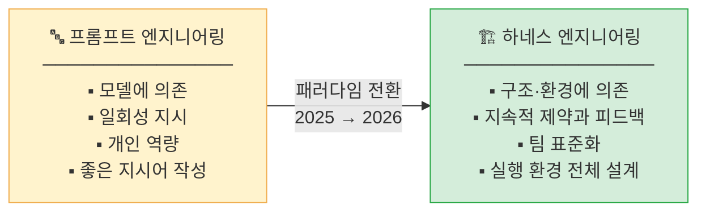
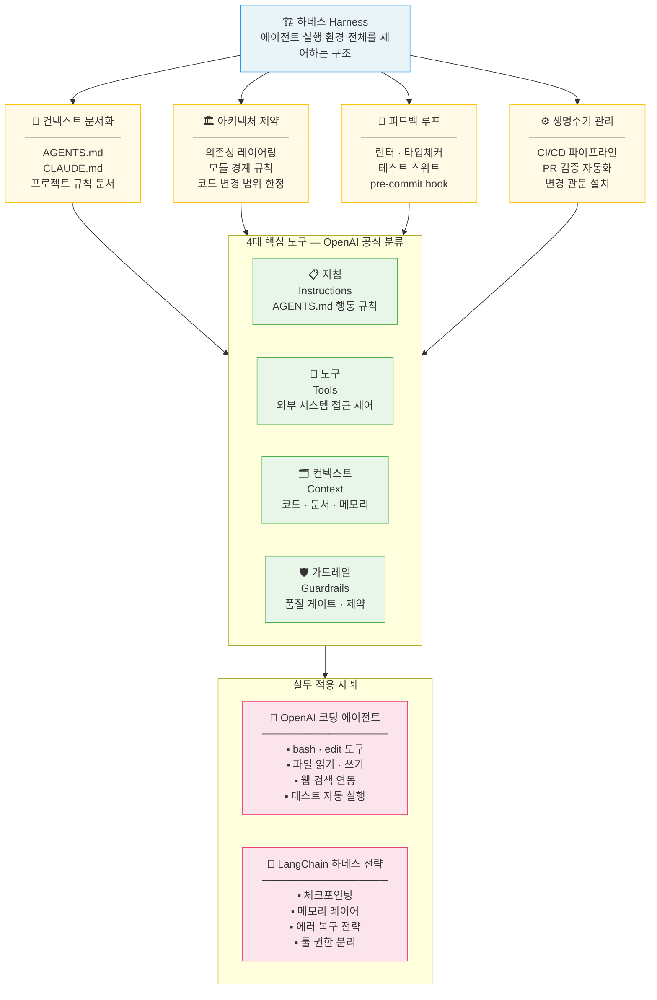

# 하네스 엔지니어링 (Harness Engineering)

> 2026년 AI 개발계에서 급부상한 패러다임 — 정보시스템 감리사를 위한 입문 가이드

---

## 1. 개념의 탄생

**2026년 2월**, HashiCorp 공동 창업자 **Mitchell Hashimoto**가 다음과 같이 명명하면서 시작되었습니다.

> "AI 에이전트가 실수할 때마다, 같은 실수를 방지하는 장치를 쌓아가는 작업"

이후 **OpenAI 공식 보고서** 발표와 함께 빠르게 업계 전반에 확산된 개념입니다.

---

## 2. 핵심 패러다임 전환



---

## 3. 왜 지금 주목해야 하나?

| 시기 | 상황 |
|------|------|
| **2025년** | AI 에이전트 기술 급속 발전, 다양한 산업 도입 시작 |
| **문제 부상** | 에이전트 수 증가 → 동작 불안정, 출력 품질 편차, 보안 사고 현실화 |
| **2026년 전환** | "에이전트를 만드는 것" → **"안전하고 안정적으로 운용하는 구조를 설계하는 것"** |

---

## 4. 하네스의 전체 구조



> **핵심 공식**: 하네스 엔지니어링 = AI 에이전트에게 일관된 고품질 성과를 이끌어내는 실행 환경 설계

---

## 5. 기존 감리 개념과의 연결

감리사 입장에서 하네스 엔지니어링은 **완전히 새로운 개념이 아닙니다**.  
기존 소프트웨어 품질관리 원칙을 AI 에이전트 환경에 맞게 재적용한 것입니다.

| 기존 감리 개념 | 하네스 엔지니어링 대응 요소 |
|--------------|--------------------------|
| **형상관리** (Configuration Management) | AGENTS.md, 아키텍처 경계 규칙 |
| **품질보증** (QA) | 린터, 타입 체커, 테스트 자동화 |
| **변경관리** (Change Management) | CI/CD 파이프라인, PR 자동 검증 |
| **표준화** (Standardization) | 코딩 컨벤션, pre-commit hook |
| **접근통제** (Access Control) | 에이전트별 도구 접근 권한 분리 |

> **엔지니어링의 엄밀함은 사라진 것이 아니라, 프롬프트 → 컨텍스트 → 하네스로 이동했을 뿐입니다.**

---

## 6. 하네스 품질이 만드는 차이

동일한 모델을 사용하는 두 팀이 **하네스 품질만으로 작업 완료율에서 40%p 차이**를 보인다는 분석이 있습니다.

```
낮은 품질의 하네스                     높은 품질의 하네스
──────────────────────────────────────────────────────
에이전트가 반복 실수                   동일 실수 재발 방지 장치 누적
일관성 없는 출력                       예측 가능한 결과물
수동 검토 의존                         자동 검증으로 빠른 피드백
팀원마다 다른 방식                     표준화된 협업 환경
```

핵심은 **"더 좋은 모델"이 아니라 "더 좋은 하네스"** 입니다.

---

## 7. 감리사를 위한 점검 포인트

### 7-1. 컨텍스트 문서화 점검

- [ ] 에이전트 행동 지침 문서(AGENTS.md 등)가 존재하는가?
- [ ] 금지 행동, 허용 범위가 명확히 명시되어 있는가?
- [ ] 문서가 최신 상태로 유지·관리되는가?

### 7-2. 아키텍처 제약 점검

- [ ] 에이전트가 접근할 수 있는 코드 영역이 제한되어 있는가?
- [ ] 모듈 경계 규칙이 자동으로 강제(enforce)되는가?
- [ ] 의존성 관리 정책이 문서화되어 있는가?

### 7-3. 피드백 루프 점검

- [ ] 린터·타입 체커가 에이전트 작업 직후 자동 실행되는가?
- [ ] 테스트 스위트가 충분한 커버리지로 구성되어 있는가?
- [ ] pre-commit hook이 필수 검증 항목을 포함하는가?

### 7-4. 생명주기 관리 점검

- [ ] CI/CD 파이프라인에 에이전트 생성 코드 검증 단계가 포함되는가?
- [ ] PR 자동 검증이 수동 승인 전에 선행되는가?
- [ ] 에이전트 작업 이력(감사 로그)이 보존되는가?

### 7-5. 접근통제 점검

- [ ] 에이전트마다 최소 권한 원칙이 적용되는가?
- [ ] 에이전트의 외부 시스템 접근이 통제·기록되는가?
- [ ] 에이전트 권한 변경 시 승인 프로세스가 있는가?

---

## 8. 관련 개념 연결

| 관련 주제 | 연결 내용 |
|----------|---------|
| [AI 개발방법론](#ai_development_methodology) | 에이전트 개발 전반의 방법론 |
| [AI 품질보장](#ai_quality_assurance) | 하네스의 테스트·검증 레이어 |
| [AI 관찰가능성](#ai_observability) | 에이전트 동작 모니터링과 하네스 연계 |
| [CodeRabbit 가이드](#coderabbit_guide) | PR 자동 검증 도구 실무 활용 |
| [MCP 기초](#mcp_fundamentals) | 에이전트 도구 접근 권한 제어 프로토콜 |

---

> **참고**: 하네스 엔지니어링은 Mitchell Hashimoto가 2026년 2월 명명하고, OpenAI 공식 보고서 발표 후 빠르게 확산된 개념입니다. AI 에이전트 운용의 안전성·안정성 확보를 위한 환경 설계 전반을 다룹니다.
