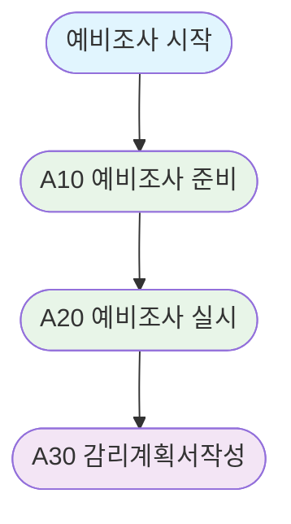
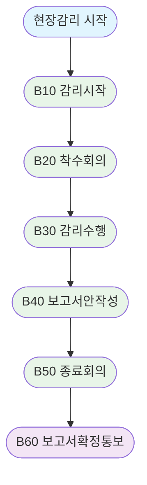

# 공통 감리절차

## 감리일정 (사례)

| 단계 | 수행활동 | 수행절차 | 세부일정 | 소요일수/공수 |
|------|----------|----------|----------|---------------|
| 예비조사 및 감리계획 수립 | | | 2025.03.15 | (1)일/(1)MD |
| 설계단계 | 클라우드 네이티브 설계내역의 적정성 및 개발 준비상황 검토 | 착수회의 | 2025.04.05 | (5)일/(60)MD |
| | | 현장감리 | 2025.04.05 ~ 04.09 | |
| | | 종료회의 | 2025.04.09 | |
| | | 검토결과서 통보 | 종료회의 후 10일 이내 | |
| 시정조치내역 확인 및 통보 | 설계단계 감리 기간에 확인 후 통보 | | | (1)일/(9)MD |

*※ 종료회의 시간은 주관기관과 감리팀 간 협의에 따라 조정될 수 있음*

## I. 공통 감리절차

단계 별 감리는 예비조사 → 현장감리 → 시정조치 확인의 순서로 이루어지며, 각 단계 별 보고서 제출

## II. A00. 예비조사

가. 예비조사 절차도

나. 세부 절차

| 세부 절차 | 설명 |
|----------|------|
| A10. 예비조사 준비 | – 예비조사/현장감리 실시가능여부확인 – 실시 일정, 투입감리원 확정 등 준비 |
| A20. 예비조사 실시 | – 사업관리문서 및 산출물 접수/검토 – 감리계획서 작성에 필요사항 도출 |
| A30. 감리계획서 작성 및 제출 | – 예비조사 실시 결과 반영하여 감리 범위, 절차, 수행방법 작성/협의/확정 최종 결과물로 감리계획서가 도출되며 발주자 및 사업자에게 공문과 함께 제출 |

## III. B00. 현장감리

가. 현장감리 절차도

나. 현장감리 세부 절차

| 세부 절차 | 설명 |
|----------|------|
| B10. 감리 시작 | – 현장감리 수행에 필요한 환경 준비 – 착수 회의 시간 및 장소 확인/준비 |
| B20. 착수 회의 | – 감리법인, 발주자, 사업자 모두 참석 – 감리수행 관련 세부 절차/내용 공유 |
| B30. 감리 수행 | – 산출물 접수, 검토, 분석, 시험 수행 – 문제점 발견 및 개선방향 도출, 면담 |
| B40. 보고서(안) 작성 및 검토 | – 감리수행결과보고서 초안 작성/검토 – 문제점 및 개선 필요사항 항목 중심 |
| B50. 종료 회의 | – 감리수행결과보고서(안) 기반 회의 – 보고서 설명 수준, 방법 등 논의 |
| B60. 보고서 확정 및 통보 | – 종료회의과정 도출된 이견 확인/반영 – 공문으로 발주자 및 사업자에게 통보 최종적으로 감리수행결과보고서가 도출되며, 공문과 함께 발주자 및 사업자에게 제출 |

## IV. C00. 시정조치 확인

가. 시정조치 확인 절차도

나. 시정조치 확인 세부 절차

| 세부 절차 | 설명 |
|----------|------|
| C10. 확인 준비 | – 개선권고사항 시정 결과에 따라 시정조치 확인 일정, 확인 방법 등 확정 |
| C20. 시정조치 확인 | – 시정조치확인계획에 따라 현장에서 결과확인, 면담실시, 미조치 사유파악 |
| C30. 시정조치확인보고서 작성/협의 | – 시정조치결과 확인 후 발견한 미/오조치내용 사실확인, 보고서작성/제출 |
| C40. 시정조치확인보고서 확정/제출 | – 시정조치확인보고서 초안에 대해 발주자, 사업자 확인 후 공식 제출 최종적으로 시정조치확인보고서가 도출되며, 발주자 및 사업자에게 공문과 함께 제출 |