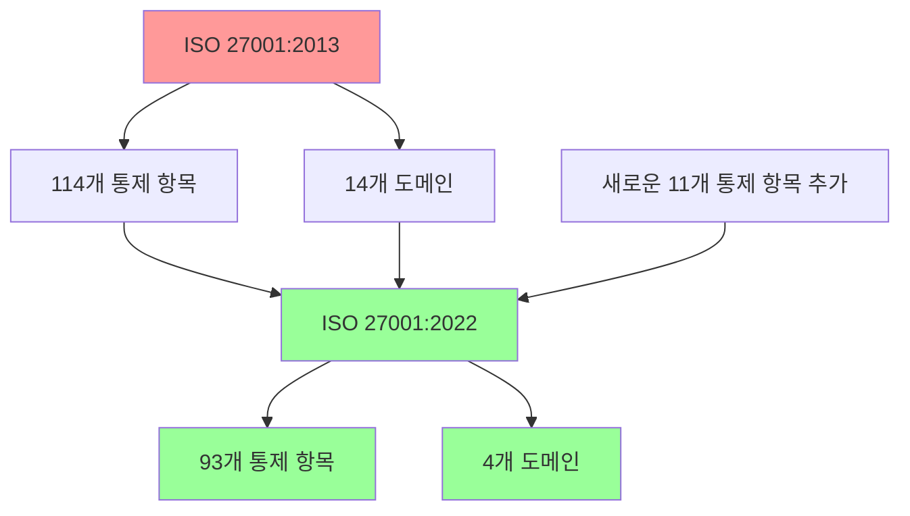
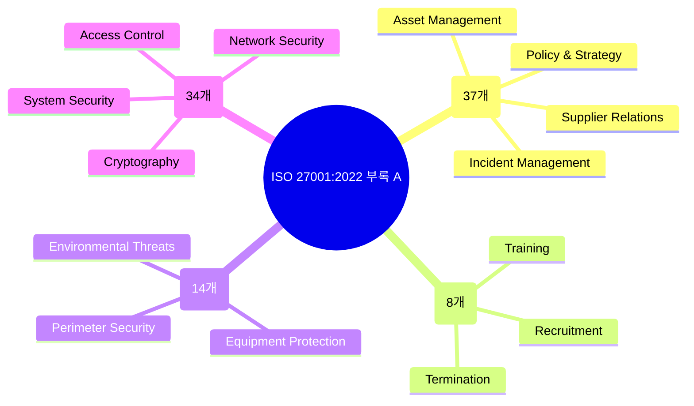

# ISO 27001 보안 통제 체계 - 감리 현장 적용 가이드

## ISO 27001 부록 A 통제 체계 개요

ISO 27001 부록 A 통제(Authoritative Controls)는 조직이 정보 보안 위험으로부터 자산을 보호하기 위해 도입할 수 있는 보안 통제 항목들의 집합입니다. 각 통제 항목은 조직의 ISMS(Information Security Management System) 범위와 직면한 위험에 따라 선택적으로 적용됩니다.

> **감리 포인트**: ISO 27001 인증을 받은 조직의 경우, 부록 A의 통제 항목 중 조직에 적용되는 항목들이 문서화되어 있어야 하며, 각 통제 항목의 구현 여부가 감리 대상이 됩니다.

### ISO 27001:2022 주요 변경 사항

- **통제 항목 수**: 114개 → 93개로 축소
- **도메인 수**: 14개 → 4개로 재편
- **새로운 통제 항목**: 11개 추가 (클라우드, 위협 인텔리전스, 시큐어 코딩 등)

#### 변경 사항 시각화

| 항목 | 2013년 버전 | 2022년 버전 |
|------|-------------|-------------|
| 통제 항목 수 | 114개 | 93개 |
| 도메인 수 | 14개 | 4개 |

## ISO 27001:2022 부록 A 4개 도메인

#### 4개 도메인 구조 시각화

### 1. 조직적 통제 (Organizational Controls, 37개)

조직 전반의 정보 보안 정책, 역할 분담, 자산 관리, 공급업체 관계, 사고 대응 등을 다루는 통제 항목입니다.

#### 주요 감리 체크리스트

| 통제 항목 | 감리 점검 항목 | 증빙 자료 |
|-----------|----------------|-----------|
| 5.1 정보 보안 정책 | 정보 보안 정책 문서 존재 여부 | 정보 보안 정책 문서 |
| 5.2 정보 보안 역할 및 책임 | 정보 보안 책임자 지정 및 역할 정의 | 조직도, 책임 정의서 |
| 5.9 정보 및 자산 목록 | 정보 자산 목록 작성 및 관리 | 자산 목록, 분류 기준 |
| 5.15 접근 통제 | 접근 통제 정책 수립 및 적용 | 접근 통제 정책, 권한 관리 기록 |
| 5.23 클라우드 서비스 보안 | 클라우드 서비스 보안 요구사항 정의 | 클라우드 보안 정책, 계약서 |
| 5.31 법적/규제 요구사항 | 법적/규제 요구사항 식별 및 관리 | 법규 요구사항 분석서 |

### 2. 인적 통제 (People Controls, 8개)

직원 채용, 교육, 퇴사 시 보안 절차 등을 다루는 통제 항목입니다.

#### 주요 감리 체크리스트

| 통제 항목 | 감리 점검 항목 | 증빙 자료 |
|-----------|----------------|-----------|
| 6.1 직원 배경 조사 | 채용 시 배경조사 수행 여부 | 배경조사 기록 |
| 6.3 보안 인식 교육 | 정기적 보안 인식 교육 이수 | 교육 이수 내역 |
| 6.7 원격 근무 | 원격 근무 보안 조치 적용 | 원격 근무 보안 정책 |

### 3. 물리적 통제 (Physical Controls, 14개)

물리적 보안 경계, 출입 통제, 장비 보호 등을 다루는 통제 항목입니다.

#### 주요 감리 체크리스트

| 통제 항목 | 감리 점검 항목 | 점검 방법 |
|-----------|----------------|-----------|
| 7.1 물리적 보안 경계 | 사무실/시설 보안 경계 설정 | 현장 점검 |
| 7.2 물리적 출입 통제 | 출입 통제 시스템 운영 | 출입 기록 확인 |
| 7.7 깨끗한 책상/화면 | 책상/화면 정리 정돈 | 현장 점검 |
| 7.14 장비 안전 폐기 | 장비 폐기 시 데이터 삭제 | 폐기 기록 확인 |

### 4. 기술적 통제 (Technological Controls, 34개)

접근 통제, 암호화, 로깅, 네트워크 보안 등 기술적 보안 조치를 다루는 통제 항목입니다.

#### 주요 감리 체크리스트

| 통제 항목 | 감리 점검 항목 | 점검 방법 |
|-----------|----------------|-----------|
| 8.2 특권 접근 권한 | 특권 계정 관리 및 모니터링 | 특권 계정 목록, 접근 로그 |
| 8.3 정보 접근 제한 | 최소 권한 원칙 적용 | 권한 설정 확인 |
| 8.7 맬웨어 방지 | 백신/EDR 솔루션 운영 | 보안 솔루션 설정 확인 |
| 8.8 기술적 취약점 관리 | 취약점 점검 및 조치 | 취약점 점검 결과 |
| 8.15 로깅 | 시스템/보안 로그 수집 | 로그 수집 설정 확인 |
| 8.24 암호화 사용 | 중요 데이터 암호화 | 암호화 정책, 설정 확인 |

## 감리 현장에서의 ISO 27001 적용 방법

### 1. 문서 검토 절차

1. **ISMS 범위 정의서** 확인
   - 감리 대상 시스템/프로세스 식별
   - 적용된 부록 A 통제 항목 목록 확인

2. **보안 정책 및 절차 문서** 검토
   - 각 통제 항목에 대한 구현 방안 문서화 여부 확인
   - 정책과 실제 운영 간 일치성 확인

3. **위험 평가 보고서** 검토
   - 통제 항목 선택 근거 확인
   - 위험 처리 계획 수립 여부 확인

### 2. 기술적 검증 절차

1. **접근 통제 확인**
   - 사용자 계정 생성/삭제 이력 확인
   - 특권 계정 사용 로그 분석
   - 접근 권한 정기 검토 이력 확인

2. **보안 솔루션 운영 확인**
   - 백신/EDR 솔루션 운영 상태
   - DLP/NGFW 등 보안 장비 설정 확인
   - 로그 수집 및 분석 체계 확인

3. **데이터 보호 조치 확인**
   - 중요 데이터 암호화 적용 여부
   - 데이터 백업 및 복구 테스트 이력
   - 외부 전송 시 보안 조치 확인

### 3. 증빙 자료 확보 가이드

| 감리 항목 | 주요 증빙 자료 | 확보 방법 |
|-----------|----------------|-----------|
| 정책 및 절차 | 보안 정책, 절차서 | 문서 제출 요청 |
| 접근 관리 | 권한 설정, 로그 | 시스템 관리자로부터 확보 |
| 보안 운영 | 점검 결과, 조치 이력 | 보안 운영 로그 |
| 교육 이수 | 교육 이수 내역 | 인사팀에서 확보 |
| 사고 대응 | 사고 대응 기록 | 보안 담당자로부터 확보 |

## ISO 27001 감리 시 주요 포인트

### 1. 통제 항목 선택 타당성
- 조직의 위험 평가 결과와 통제 항목 선택 간 일치성 확인
- 선택하지 않은 통제 항목에 대한 정당화 문서 존재 여부

### 2. 구현 수준 평가
- 문서화 수준
- 실제 운영 수준
- 정책과 운영 간 일치성

### 3. 지속적 개선
- 내부 감사 이력
- 관리자 검토 이력
- 지속적 개선 조치 이력

> **감리 팁**: ISO 27001은 프레임워크이지 체크리스트가 아닙니다. 조직의 특성과 위험에 맞는 맞춤형 적용이 핵심이며, 감리 시에도 이러한 맥락을 고려한 평가가 필요합니다.